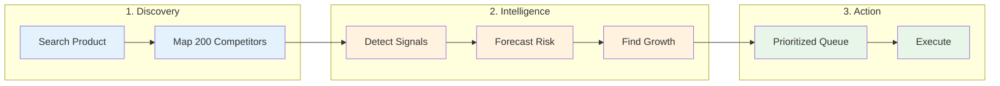

# ShelfGuard

> **The Predictive Operating System for CPG Brands**

ShelfGuard transforms how consumer brands manage Amazon portfolios. Instead of passive dashboards showing what happened, ShelfGuard tells you what to do next—autonomously detecting threats, forecasting risk, and surfacing growth opportunities across your entire catalog.

---


---

## The Problem

CPG brands managing 50-500+ ASINs face a visibility crisis:

- **Dashboards show data, not decisions** — You see metrics but don't know what to do
- **Risk signals are reactive** — You find out about problems after revenue is lost
- **Growth opportunities are buried** — Manual research can't keep pace with market changes
- **No unified view** — Pricing, inventory, and advertising tools don't talk to each other

## The Solution

ShelfGuard replaces analysis paralysis with **prescriptive intelligence**:

```
┌────────────────────────────────────────────────────────────────┐
│                     SHELFGUARD OS                              │
├────────────────────────────────────────────────────────────────┤
│                                                                │
│   📊 Market Data ──→ 🧠 Unified AI ──→ ⚡ Action Queue         │
│   (36 months)         Engine           (Prioritized)           │
│                                                                │
│   "RXBAR Variety    "DISTRESS:        "Pause ads,              │
│    Pack BSR +340%    margin erosion    cut price 12%,          │
│    in 14 days"       detected"         restock by Tue"         │
│                                                                │
└────────────────────────────────────────────────────────────────┘
```

---

## How It Works



### Phase 1: Two-Phase Discovery
Enter a product ASIN or keyword. ShelfGuard automatically maps your entire competitive landscape—up to 200 products with 36 months of price, rank, and review history.

### Phase 2: Unified Intelligence
A single AI engine analyzes every product across three dimensions:

| Layer | Question Answered | Output |
|-------|-------------------|--------|
| **Strategic** | "What state is this product in?" | FORTRESS, HARVEST, TRENCH_WAR, DISTRESS, TERMINAL |
| **Predictive** | "What's at risk in 30 days?" | $ revenue at risk, burn rate, cost of inaction |
| **Growth** | "What opportunity exists?" | Price headroom, conquest targets, expansion paths |

### Phase 3: Prescriptive Action
Every product gets a specific recommendation with causal reasoning:

> "**Raise price 8%** BECAUSE competitor X is out of stock and you have 94% Buy Box ownership"

---

## The Command Center


### Strategic Governor
Bias the AI toward your current business objective:

| Mode | Behavior |
|------|----------|
| **Profit** | Maximize margins. Cut underperformers. Raise prices. |
| **Balanced** | Optimize risk-adjusted returns. Defend market share. |
| **Growth** | Forgive low margins for velocity. Scale winners. Conquest. |

### Opportunity Alpha
The unified metric that matters: **30-Day Risk + 30-Day Growth**

Every product shows its total dollar opportunity—what you'll lose if you do nothing, plus what you'll gain if you act.

### Action Queue
AI-prioritized list sorted by impact. No more guessing where to focus.

---

## Architecture

```
ShelfGuard/
├── apps/                    # Streamlit UI
│   ├── shelfguard_app.py   # Command Center
│   └── search_to_state_ui.py
│
├── src/                     # Intelligence Pipeline
│   ├── two_phase_discovery.py
│   ├── trigger_detection.py
│   └── network_intelligence.py
│
├── utils/                   # Core Engine
│   ├── ai_engine.py        # Unified AI Brain
│   └── data_healer.py
│
├── scrapers/               # Data Ingestion
│   └── keepa_client.py
│
└── pipelines/              # Background Jobs
    └── harvest_tracked_asins.py
```

### Performance
- **800x faster** than row-wise processing (12ms for 100 ASINs)
- **Sub-second** dashboard loads with intelligent caching
- **Vectorized** NumPy operations throughout

---

## Quick Start

```bash
# Clone
git clone https://github.com/jshuck/ShelfGuard.git
cd ShelfGuard

# Install
pip install -r requirements.txt

# Configure (create .streamlit/secrets.toml)
# Add: keepa.api_key, openai.api_key, supabase.url, supabase.key

# Run
streamlit run apps/shelfguard_app.py
```

---

## Roadmap

| Phase | Status | Focus |
|-------|--------|-------|
| v1.0 | ✅ | Strategic classification, Data healing |
| v2.0 | ✅ | Predictive risk forecasting |
| v3.0 | ✅ | Growth intelligence, Vectorized performance |
| v4.0 | 🔜 | SP-API integration, One-click execution |
| v5.0 | 📋 | Multi-agent orchestration |

---

## Built With

- **OpenAI GPT-4o-mini** — Strategic reasoning
- **Keepa API** — Market intelligence
- **Streamlit** — Command Center UI
- **Supabase** — Real-time database
- **NumPy/Pandas** — Vectorized processing

---

**Stop analyzing. Start executing.**
