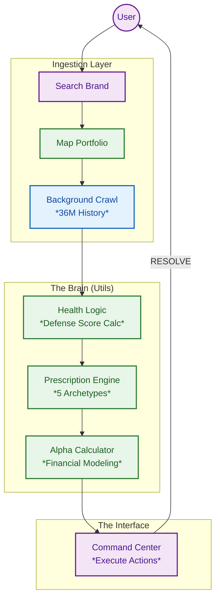

# 🛡️ ShelfGuard: The Vertical Operating System for CPG Brands

> **Stop analyzing data. Start executing strategy.**

ShelfGuard is a **Predictive Operating System** for modern consumer brands. It replaces passive dashboards with an active command center that autonomously detects threats, quantifies financial leaks ("Recoverable Alpha"), and prescribes specific actions to fix them.

Built for **High-Velocity CPG Teams**, it bridges the gap between **Strategy** and **Execution**—triangulating 36 months of market intelligence (Keepa) with real-time portfolio performance to tell you exactly where to focus your resources.

---


---

## 📸 The Command Center

*The Command Center replaces "analysis" with "action." It displays a real-time Defense Score, calculates Recoverable Alpha ($), and prioritizes the top 3 highest-value moves for the session.*

---

## ⚙️ The Intelligence Engine: "Map & Crawl"
Unlike static reports that rely on pre-baked data, ShelfGuard builds its intelligence layer dynamically in real-time.

1.  **🔍 Search & Discovery:**
    The user enters a brand name (e.g., "Tide" or "Frito-Lay") in the Market Discovery module.
2.  **🗺️ Portfolio Mapping:**
    The system instantly scans the marketplace to construct a **"Digital Twin"** of the brand's catalog—identifying parent/child variations, hidden duplicate listings, and unauthorized reseller nodes.
3.  **🕷️ Deep-Dive Enrichment (Background):**
    Once mapped, a background crawler initiates a 36-month historical extraction for every identified SKU. It pulls price history, sales rank volatility, and competitive density, "hydrating" the dashboard with deep context before the user even reaches the Command Center.

---

## 📉 The Problem: "Dashboard Fatigue"
Current e-commerce tools are **Passive Reporting Engines**. They dump data on the user and ask *them* to figure out what to do. This creates a "Cognitive Tax" that leads to paralysis:
* **Tableau/PowerBI:** "Here is a chart of your sales dropping. Good luck."
* **Seller Central:** "Here are 500 notifications. Figure out which one matters."
* **Ad Tools:** "Spend more money to get more sales (even if you lose margin)."

**The Result:** Managers spend 80% of their time *diagnosing* problems and only 20% *fixing* them. Brands miss opportunities because the data is trapped in silos.

---

## 🚀 The Solution: Active Intelligence
ShelfGuard is not just a dashboard; it is a **Decision Engine**. It continuously monitors every product in your portfolio and enforces a strict **Protocol** for growth and defense.

### 🧠 Core Mechanics

#### 1. 🛡️ The Defense Score (Moat Health)
A proprietary health score (0-98) that measures the **durability** of a brand's market position. Unlike Revenue (which looks backward), the Defense Score looks forward, penalizing for:
* **Market Share Erosion:** Losing velocity relative to competitors.
* **Margin Compression:** Lowering price to sustain volume.
* **Competitive Threats:** New entrants stealing Buy Box or keyword share.

#### 2. 💰 Recoverable Alpha (The "Bounty")
ShelfGuard introduces a new financial metric: **Recoverable Alpha**.
* **Definition:** The exact dollar amount of revenue currently being lost to inefficiencies (e.g., stockouts, ad waste, price leaks).
* **Workflow:** The dashboard presents this as a "Bounty Board." Users click **"RESOLVE"** to capture the value, moving dollars from *Risk* to *Banked*.

#### 3. 🤖 The "AI Strategist" (Prescriptive Logic)
Instead of generic advice, ShelfGuard uses multi-variate logic to act as a Senior Strategist. It identifies 5 specific archetypes:
* **"The Hidden Bleeder":** High Revenue + Low Margin → *Directive: CUT AD WASTE*
* **"The Silent Winner":** High Conversion + Low Traffic → *Directive: SCALE MEDIA SPEND*
* **"The Stockout Hazard":** High Velocity + Low Inventory → *Directive: THROTTLE & PRESERVE*
* **"The Margin Trap":** Price < Market Avg + High Rank → *Directive: TEST PRICE ELASTICITY*
* **"The Zombie":** High Impressions + Low CTR → *Directive: CREATIVE OVERHAUL*

---

## 🛠️ Tech Stack & Architecture

ShelfGuard utilizes a "Fetch-Compute-Serve" architecture designed for speed and state management.



---

## 🔮 Roadmap: From "Driver Assist" to "Autopilot"

### Phase 1: The "Iron Man Suit" (Current MVP)
**Goal:** Augment the human manager.

**Feature:** User clicks "Resolve," system generates the strategy. Human executes in Seller Central.

### Phase 2: Agentic Write-Access (Q2 2026)
**Goal:** "Human-in-the-loop" automation.

**Feature:** Clicking "RESOLVE" uses the SP-API to physically update the price or pause the ad campaign on Amazon.

### Phase 3: Autonomous Finance (Q4 2026)
**Goal:** Self-driving portfolio.

**Feature:** User sets "Policy Constraints" (e.g., "Min Margin 15%"). ShelfGuard autonomously adjusts bids and prices 24/7 to maximize Recoverable Alpha.

---

## ⚡ Quick Start

```bash
# Clone Repo
git clone https://github.com/jshuck0/ShelfGuard.git

# Install Dependencies
pip install -r requirements.txt

# Run App
streamlit run apps/shelfguard_app.py
```
