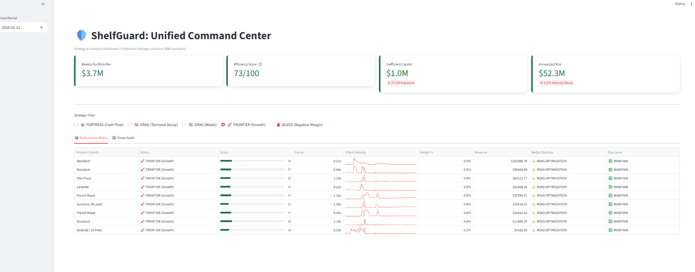
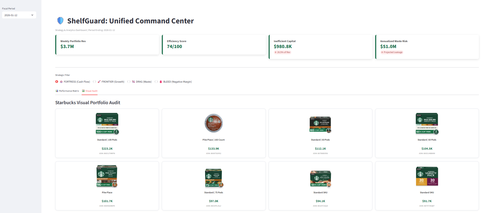
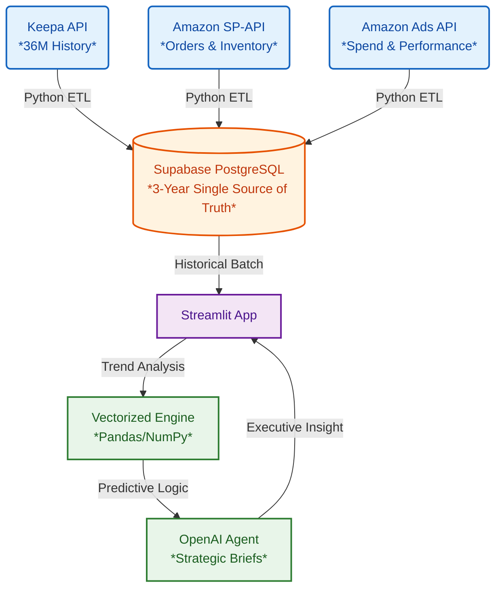

# 🛡️ ShelfGuard: The Predictive Operating System for CPG Brands

> **Stop optimizing ROAS. Start protecting Enterprise Value.**

ShelfGuard is an autonomous capital allocation engine for modern consumer brands, developed to bridge the gap between Director-level strategy and technical execution. It triangulates **Advertising Data** (Amazon Ads), **Inventory Logistics** (SP-API), and **36-Month Market Intelligence** (Keepa) to act as an automated CFO—directing capital away from "zombie" SKUs and toward high-velocity, high-margin opportunities.

---


---

## 📸 Demo: Predictive Command Center


*Unified Command Center displaying 36-month trend sparklines, Predictive Efficiency Scores, and Strategic Action Zones.*

---

## 📉 The Problem: The "Short-Termism" Trap
Current e-commerce tools optimize for the **next 24 hours**, leading to long-term capital destruction. Drawing on experience as a Director of Strategy & Analytics, this tool addresses the "Silo Trap" common in large-scale CPG brands:

* **Ad Managers (Pacvue, Perpetua):** Optimize for *Spend* (ROAS), often scaling spend on products with good 7-day ROAS even if they are in a 3-year "death spiral."
* **Ops Tools (SoStocked):** Optimize for *Stock*, but fail to signal when marketing should be throttled to prevent stockouts on low-margin variations.
* **Finance Tools (A2X):** Look *backward* at last month's P&L, providing no guidance on where the next dollar of growth capital should go.

**The Result:** Brands spend thousands on ads for products that are out of stock, low margin, or losing fundamental market momentum.

---

## 🚀 The Solution: Predictive Capital Allocation
ShelfGuard sits above these silos, functioning as a "Director of Strategy in a Box." By ingesting **36 months of historical data** via Keepa and Supabase APIs, it answers the critical strategic question: **"Is this revenue building our brand or draining our cash reserve?"**

### 🚀 Core Capabilities

#### 1. 🏰 Strategic Capital Zones (Multi-Year Context)
ShelfGuard classifies every SKU into a strategic posture based on Margin, Inventory, and Historical Momentum:
* **🏰 FORTRESS (Cash Flow):** High-margin assets with stable 3-year velocity. Directive: Maximize Yield.
* **🚀 FRONTIER (Growth):** High-potential items with improving BSR momentum. Directive: Aggressive Market Share.
* **📉 DRAG (Terminal Decay):** SKUs showing persistent YoY velocity loss. Directive: Liquidate/Exit.
* **🩸 BLEED (Negative Margin):** Capital-destructive units. Directive: Hard Halt.

#### 2. 🚦 Automated Decision Logic
The Command Center translates complex financial data into two clear execution paths for every SKU:

| Execution Path | Purpose | Data Signal | Media Directive |
| :--- | :--- | :--- | :--- |
| **Media Lever** | Directs Advertising Spend | High Momentum + High Margin | Scale Spend & Optimize ROAS |
| **Ops Lever** | Directs Operational Changes | Low Margin + Low Inventory | Test Price (+5%) or Exit SKU |

#### 3. 📉 Predictive Waste Engine
Unlike tools that simply multiply last week's waste by 52, ShelfGuard calculates Annualized Risk by weighting inefficiency against a 36-month Velocity Decay Factor. This surfaces the true "Cost of Inaction" for underperforming SKUs.

---

### 🧠 Under the Hood: The Intelligence Layer
ShelfGuard utilizes vectorized time-series analysis (Pandas/NumPy) to calculate momentum shifts across 150+ weeks of historical rank data, an approach refined through coursework in "Data Intelligence" at the Chicago Booth School of Business.

#### The Velocity Decay Factor
Quantified as a core risk metric, it compares a product's current sales rank (BSR) to its 3-year historical baseline. A factor of **1.20x** indicates the product is 20% less efficient than its long-term average.

```python
def analyze_velocity_decay(asin, history_df):
    """
    Vectorized calculation of 3-year momentum.
    Compares recent 8-week performance to 150-week baseline.
    """
    # 1. Establish the 36-month baseline from Supabase
    long_term_avg = history_df['sales_rank_filled'].mean()
    
    # 2. Capture the recent trend (2 months)
    recent_avg = history_df.sort_values('week_start', ascending=False).head(8)['sales_rank_filled'].mean()
    
    # Decay > 1.0 = Rank is worsening (higher) than the 36-month mean
    return round(recent_avg / long_term_avg, 2)
```

---

## 🛠️ Tech Stack & Architecture



---

## 🔮 Product Roadmap

### Phase 1: Omnichannel Integration (Q1 2026)
* **[ ] DTC Integration (Shopify):** Cross-channel traffic routing (Amazon vs. DTC).
* **[ ] Paid Social Attribution:** Correlating Meta/Google spend with Amazon BSR lift.

### Phase 2: Agentic Execution & Action (Q2 2026)
* **[ ] Automated Media Control:** Direct write-access to Ads API to throttle "Terminal Decay" SKUs.
* **[ ] Dynamic Bidding:** Autonomous bid adjustments based on "Inventory Cover" signals.

### Phase 3: Validation & Enterprise Scale (Q3 2026)
* **[ ] Vertical Case Studies:** Documentation of Contribution Margin expansion.
* **[ ] Multi-Tenant Architecture:** Support for multiple brand instances within a single secure deployment.

---

## ⚡ Quick Start (Local Dev)
1. **Clone Repo:** `git clone https://github.com/jshuck0/ShelfGuard.git`
2. **Install Deps:** `pip install -r requirements.txt`
3. **Set Secrets:** Configure `.streamlit/secrets.toml` with Supabase and OpenAI keys.
4. **Launch:** `streamlit run app.py`

---

## 📄 License
Private Proprietary Software. All rights reserved.