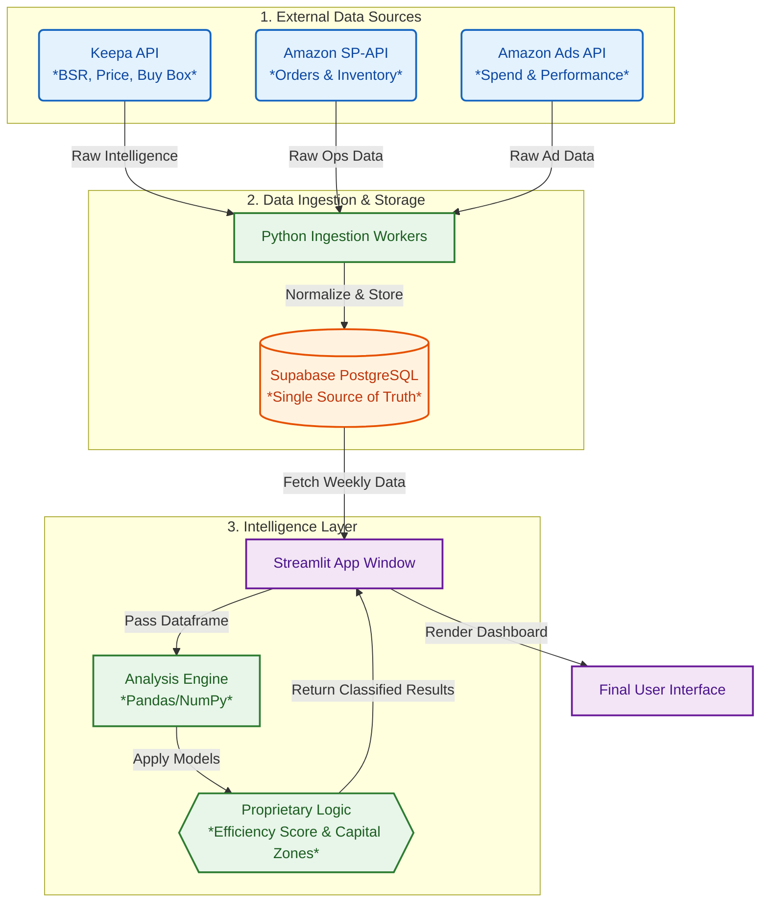

# 🛡️ ShelfGuard: The Financial Operating System for CPG Brands

> **Stop optimizing ROAS. Start optimizing Capital Efficiency.**

ShelfGuard is an autonomous capital allocation engine for modern consumer brands. It triangulates **Advertising Data** (Amazon Ads), **Inventory Logistics** (SP-API), and **Competitive Intelligence** (Keepa) to act as an automated CFO—directing every dollar of ad spend to where it generates the highest Net Margin, not just the most clicks.

---

## 📸 Demo
### Unified Command Center
The dashboard provides a real-time "Command Center" view of portfolio health, categorizing SKUs into strategic action zones based on financial performance and inventory risk.


---

## 📉 The Problem: The "Silo Trap"
Current e-commerce tools are fragmented, leading to massive capital inefficiency:
* **Ad Managers (Pacvue, Perpetua):** Optimize for *Spend* (ROAS), ignoring inventory health.
* **Ops Tools (SoStocked):** Optimize for *Stock*, ignoring marketing pushes.
* **Finance Tools (A2X):** Look *backward* at last month's P&L.

**Result:** Brands spend thousands on ads for products that are out of stock, low margin, or losing the Buy Box.

## 🚀 The Solution: ShelfGuard
ShelfGuard sits above these silos. It ingests data from all three sources to answer the single most important question: **"Where should my next dollar go?"**

### Core Capabilities

#### 1. 🏰 Strategic Capital Zones
ShelfGuard classifies your entire catalog into four distinct investment zones:
* **🏰 FORTRESS (Cash Flow):** High Share, Healthy Stock. *Action: Scale Ad Spend / Test Price +5%.*
* **🚀 FRONTIER (Growth):** Good Fundamentals, Low Share. *Action: Aggressive Investment.*
* **📉 DRAG (Waste):** High Spend, Low Return. *Action: Immediate Divestment / ROAS Optimization.*
* **🩸 BLEED (Negative Margin):** Selling at a loss. *Action: Halt Spend / Price Correction.*

#### 2. 🚦 The Omni-Channel Traffic Router
ShelfGuard monitors "Ground Truth" (Buy Box Status & Inventory Levels) to direct external traffic:
* **Scenario A:** Buy Box is Won & In Stock → **Drive Traffic to Amazon** (Flywheel Effect).
* **Scenario B:** Buy Box Lost (Price War) → **Divert Traffic to Shopify/DTC** (Protect Margin).

---

## 🧠 Under the Hood: The Logic Layer

ShelfGuard uses two proprietary algorithms to bridge the gap between "Raw Data" and "Financial Strategy."

### 1. The Efficiency Score (0-100)
A dynamic risk metric calculated daily for every SKU to prevent "Empty Calorie" ad spend. It penalizes revenue that doesn't contribute to long-term enterprise value.

```python
def calculate_efficiency_score(row):
    """
    Quantifies the risk/reward ratio of ad spend based on inventory health.
    """
    # 1. Inventory Velocity Penalty: If we have < 2 weeks cover, score drops
    if row['weeks_of_cover'] < 2.0:
        return 0.0
    
    # 2. Margin Impact: High margin items get a multiplier
    margin_factor = 1.0 + (row['net_margin_pct'] * 2)
    
    # 3. Buy Box Binary: If we don't own the Buy Box, marketing is waste
    buy_box_factor = 1.0 if row['buy_box_owner'] == 'SELF' else 0.1
    
    base_score = (row['cv_rate'] / row['category_avg_cv']) * 50
    return min(100, base_score * margin_factor * buy_box_factor)
```

### 2. The Intelligence Layer: Estimation Engine
ShelfGuard uses a transparent **Power Law Regression** model to convert Sales Rank (BSR) into Unit Sales, allowing for competitive benchmarking against category leaders.

---

## 🛠️ Tech Stack & Architecture



* **Frontend:** Streamlit (Custom CSS-themed dashboard)
* **Database:** Supabase (PostgreSQL)
* **Intelligence:** OpenAI API (for agentic insight generation)
* **Data Sourcing:** Keepa API, Amazon SP-API & Ads API
* **Processing:** Pandas & NumPy for financial modeling

---

## ⚡ Quick Start (Local Dev)

**1. Clone & Set Up Environment**
```bash
git clone [https://github.com/jshuck0/ShelfGuard.git](https://github.com/jshuck0/ShelfGuard.git)
cd ShelfGuard
python -m venv .venv
source .venv/bin/activate 
pip install -r requirements.txt
```

**2. Configure Secrets**
Create a `.streamlit/secrets.toml` file (do NOT commit this):
```toml
[supabase]
url = "your_supabase_url"
key = "your_supabase_anon_key"

[keepa]
api_key = "your_keepa_api_key"

[openai]
api_key = "your_openai_key"
```

**3. Run the Command Center**
```bash
streamlit run app.py
```

---

## 📄 License
Private Proprietary Software. All rights reserved.