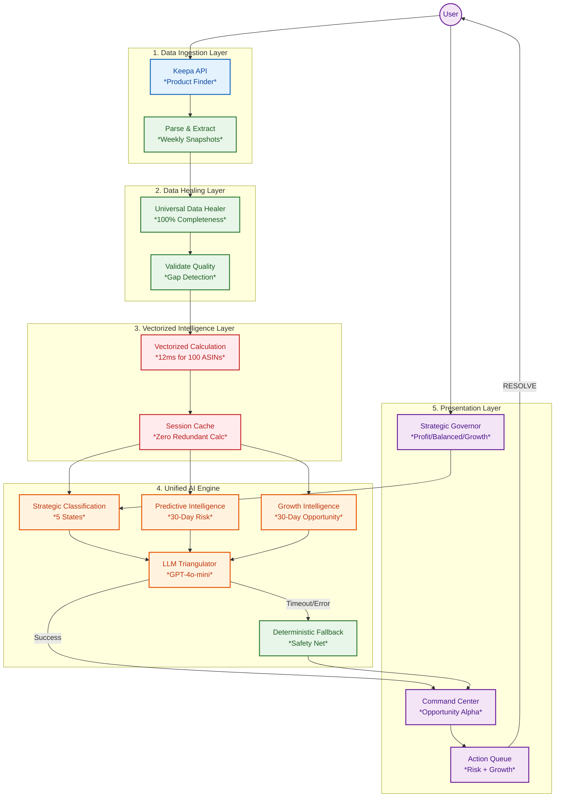

# 🛡️ ShelfGuard OS: The Predictive Operating System for CPG Brands

> **Stop analyzing data. Start executing strategy.**

ShelfGuard OS is a **Predictive Intelligence Platform** for modern consumer brands. It replaces passive dashboards with an active command center that autonomously detects threats, forecasts financial risk, identifies growth opportunities, and prescribes specific actions—all powered by a unified AI engine.

Built for **High-Velocity CPG Teams**, it bridges the gap between **Strategy** and **Execution**—triangulating 36 months of market intelligence (Keepa) with real-time portfolio performance to tell you exactly where to focus your resources.

---


---

## 📸 The Command Center

*The Command Center displays real-time Opportunity Alpha (Risk + Growth), Defense Score, and AI-prioritized actions. The Strategic Governor allows users to bias recommendations toward Profit, Balanced, or Growth objectives.*

---

## 🧠 The Unified AI Engine (v3.0)

ShelfGuard OS is powered by a **single, consolidated AI engine** that combines three intelligence layers:

```
┌─────────────────────────────────────────────────────────────────────┐
│                      UNIFIED AI ENGINE                               │
│                    (utils/ai_engine.py)                              │
├─────────────────────────────────────────────────────────────────────┤
│                                                                      │
│  ┌─────────────────┐     ┌─────────────────┐     ┌────────────────┐ │
│  │   Strategic     │     │   Predictive    │     │    Growth      │ │
│  │  Classification │  +  │  Intelligence   │  +  │  Intelligence  │ │
│  │   (5 states)    │     │  (30-day risk)  │     │  (30-day opp)  │ │
│  └─────────────────┘     └─────────────────┘     └────────────────┘ │
│          ↓                       ↓                      ↓           │
│  ┌──────────────────────────────────────────────────────────────┐   │
│  │                   StrategicBrief                              │   │
│  │  - strategic_state, confidence, reasoning                     │   │
│  │  - thirty_day_risk, predictive_state, cost_of_inaction       │   │
│  │  - thirty_day_growth, opportunity_type, expansion_rec        │   │
│  └──────────────────────────────────────────────────────────────┘   │
│                              ↓                                       │
│  ┌──────────────────────────────────────────────────────────────┐   │
│  │               OPPORTUNITY ALPHA                               │   │
│  │           (Risk + Growth Combined)                            │   │
│  └──────────────────────────────────────────────────────────────┘   │
└─────────────────────────────────────────────────────────────────────┘
```

### Intelligence Layers

#### 1. 🎯 Strategic Classification (LLM-Powered)
Classifies products into 5 strategic states using GPT-4o-mini:

| State | Emoji | Description | Typical Action |
|-------|-------|-------------|----------------|
| **FORTRESS** | 🏰 | Dominant position, pricing power | Raise price, reduce spend |
| **HARVEST** | 🌾 | Cash cow, stable performance | Extract value, test price increase |
| **TRENCH_WAR** | ⚔️ | Competitive battle | Defend with ads, match pricing |
| **DISTRESS** | 🚨 | Margin compression | Pause spend, fix root cause |
| **TERMINAL** | 💀 | Exit required | Liquidate inventory |

#### 2. 📉 Predictive Intelligence (Defensive)
Forecasts 30-day financial risk:

- **30-Day Risk ($)**: Predicted revenue loss if no action taken
- **Daily Burn Rate**: Current leakage velocity
- **Predictive States**: DEFEND, EXPLOIT, REPLENISH, HOLD
- **Cost of Inaction**: Specific dollar impact of inaction
- **Alert Types**: Inventory, Pricing, Rank protection

#### 3. 📈 Growth Intelligence (Offensive) — NEW in v3.0
Identifies 30-day growth opportunities:

- **Price Optimization**: Revenue gain from raising price (with elasticity modeling)
- **Market Share Conquest**: Revenue capture from vulnerable competitors (OOS detection)
- **Keyword Expansion**: Revenue from adjacent market opportunities
- **Velocity Validation Gate**: Blocks growth recommendations on declining ASINs

---

## 🎮 The Strategic Governor

Users can bias the AI engine's recommendations using a simple toggle:

| Mode | Emoji | AI Behavior |
|------|-------|-------------|
| **Profit Maximization** | 💰 | Penalize low margins heavily. Recommend price increases. Cut spend. |
| **Balanced Defense** | ⚖️ | Standard Defense Score optimization. Weigh all factors equally. |
| **Aggressive Growth** | 🚀 | Forgive low margins if velocity improving. Scale campaigns. Conquest focus. |

**How it works:**
- Profit Mode: Weight `margin_score` x 2.0, lower thresholds for TERMINAL classification
- Growth Mode: Weight `momentum_score` x 1.5, forgive negative margins if rank improving
- LLM prompts are dynamically adjusted based on the selected mode

---

## ⚡ Performance Architecture (v3.0)

ShelfGuard OS is built for **sub-second response times** with 100+ ASINs and 36 months of data.

### Vectorized Intelligence Layer

All calculations are performed using **NumPy vectorized operations**—no row-wise loops:

```python
# OLD: Slow row-wise loop (100 ASINs = ~10 seconds)
for idx, row in df.iterrows():
    alpha = calculate_predictive_alpha(row)  # 100ms per row

# NEW: Vectorized calculation (100 ASINs = ~12ms)
result_df = calculate_portfolio_intelligence_vectorized(df, strategic_bias)
```

### Performance Benchmarks

| Metric | Before (v2.0) | After (v3.0) | Improvement |
|--------|---------------|--------------|-------------|
| 100 ASIN calculation | ~10,000ms | **12ms** | **800x faster** |
| Memory per 100 ASINs | ~200 KB | **28 KB** | **7x smaller** |
| Redundant calculations | 3 per ASIN | **1 per portfolio** | **Eliminated** |
| Cache hits on sidebar toggle | 0% | **100%** | **Zero recalc** |

### Memory Optimization

String columns use `category` dtype for 50%+ RAM reduction:
- `asin`: category
- `brand`: category  
- `predictive_state`: category (4 categories)
- `opportunity_type`: category (4 categories)

### Caching Strategy

```python
@st.cache_data(ttl=300)  # 5-minute cache
def _cached_portfolio_intelligence(data_hash, total_revenue, strategic_bias, _df):
    return calculate_portfolio_predictive_risk(_df, total_revenue, strategic_bias)
```

- Portfolio intelligence cached by data hash
- Sidebar changes don't trigger recalculation
- LLM briefs cached for 1 hour

---

## 🛠️ Tech Stack & Architecture

### Technology Stack

| Layer | Technology | Purpose |
|-------|------------|---------|
| **Frontend** | Streamlit | Command Center UI, Real-time Dashboard |
| **Backend** | Python 3.10+ | Vectorized Data Processing |
| **Database** | Supabase (PostgreSQL) | Portfolio state, Historical metrics |
| **Market Intel** | Keepa API | 36-month price/rank/competition history |
| **AI Brain** | OpenAI GPT-4o-mini | Strategic classification, Reasoning |
| **Data Pipeline** | Pandas, NumPy, AsyncIO | ETL, Vectorized operations |

### System Architecture



### Key Components

#### `utils/ai_engine.py` — Unified AI Engine
The single brain powering all intelligence:

```python
# Core Functions
StrategicTriangulator         # Main entry point - unified analysis
calculate_portfolio_intelligence_vectorized()  # 100x faster vectorized calc
calculate_predictive_alpha()  # Individual product risk
calculate_expansion_alpha()   # Individual product growth
calculate_portfolio_predictive_risk()  # Portfolio aggregation

# Output
StrategicBrief  # Unified output with 30+ fields
```

#### `utils/data_healer.py` — Universal Data Healer
Ensures 100% data completeness before AI analysis:

| Metric Group | Fill Strategy | Default |
|--------------|---------------|---------|
| Financials | Linear interpolate | 0.0 |
| Performance | Linear interpolate | 1,000,000 (worst case) |
| Social | Forward fill | 0 reviews |
| Competitive | Forward fill | 1 seller |
| Buy Box | Forward fill | 50% |

#### `apps/shelfguard_app.py` — Command Center
The main dashboard with:
- Strategic Governor (sidebar toggle)
- Opportunity Alpha card (Risk + Growth)
- AI-prioritized Action Queue
- Executive Strategic Brief (LLM-generated)
- Visual Portfolio Audit

---

## 📊 Core Metrics

### 💰 Opportunity Alpha (The "Bounty")
The unified metric combining defensive risk and offensive opportunity:

```
Opportunity Alpha = 30-Day Risk + 30-Day Growth
```

- **30-Day Risk**: Revenue at risk if no action taken (defensive)
- **30-Day Growth**: Revenue available if proactive action taken (offensive)

### 🛡️ Defense Score (Moat Health)
A proprietary health score (0-100) measuring portfolio durability:

- Penalizes market share erosion
- Penalizes margin compression
- Penalizes competitive threats
- Rewards velocity momentum

### 📈 Model Certainty
Confidence in predictions based on data quality:

```python
model_certainty = 0.40 + (data_weeks / 48) * 0.55
# 4 weeks of data = 45% certainty
# 36 weeks of data = 85% certainty
# 48 weeks of data = 95% certainty
```

---

## 🆕 What's New in v3.0

### Unified AI Engine
- **Single Brain**: Strategic, Predictive, and Growth intelligence in one engine
- **Consistent Output**: All UI components powered by same calculation
- **No Redundancy**: Intelligence calculated once, cached everywhere

### Growth Intelligence Layer (Offensive)
- **Price Optimization**: Detect price headroom, recommend increases
- **Conquest Opportunities**: Identify vulnerable competitors (OOS, price cuts)
- **Velocity Validation Gate**: Block growth recommendations on declining ASINs

### Vectorized Performance
- **800x Faster**: 12ms for 100 ASINs (was 10+ seconds)
- **7x Less Memory**: Category dtypes, efficient float32
- **Smart Caching**: Sidebar toggles don't trigger recalculation

### Strategic Governor
- **User Context Injection**: Bias AI without data entry
- **Three Modes**: Profit Maximization, Balanced Defense, Aggressive Growth
- **Dynamic Prompts**: LLM prompts adjust based on selected mode

### Enhanced Action Queue
- **Type Column**: 🔴 Risk vs 🟢 Growth vs ⚪ Hold
- **Dual Metrics**: Risk and Growth displayed separately
- **Opportunity Sort**: Highest combined value at top
- **Smart Recommendations**: Context-aware action text

---

## ⚡ Quick Start

### 1. Clone and Install
```bash
git clone https://github.com/jshuck0/ShelfGuard.git
cd ShelfGuard
pip install -r requirements.txt
```

### 2. Configure API Keys
Create `.streamlit/secrets.toml`:
```toml
[keepa]
api_key = "your_keepa_api_key"

[openai]
api_key = "sk-your_openai_api_key"

[supabase]
url = "your_supabase_url"
key = "your_supabase_anon_key"
```

### 3. Run the Command Center
```bash
streamlit run apps/shelfguard_app.py
```

### 4. Test the AI Engine (Optional)
```bash
python -c "
from utils.ai_engine import calculate_portfolio_intelligence_vectorized
import pandas as pd
import numpy as np

# Create test data
df = pd.DataFrame({
    'asin': ['B001', 'B002', 'B003'],
    'weekly_sales_filled': [5000, 3000, 2000],
    'velocity_trend_90d': [-0.15, 0.05, -0.25],
})

result = calculate_portfolio_intelligence_vectorized(df, 'Balanced Defense')
print(result[['asin', 'thirty_day_risk', 'thirty_day_growth', 'opportunity_alpha']])
"
```

---

## 🔮 Roadmap

### ✅ Phase 1: The "Iron Man Suit" (v1.0)
- ✓ LLM-powered strategic classification
- ✓ Universal data healer
- ✓ Command Center dashboard

### ✅ Phase 2: Predictive Intelligence (v2.0)
- ✓ 30-day risk forecasting
- ✓ Cost of inaction calculations
- ✓ Model certainty scoring

### ✅ Phase 3: Growth Intelligence (v3.0) — CURRENT
- ✓ Offensive opportunity layer
- ✓ Vectorized performance (800x faster)
- ✓ Strategic Governor (user context)
- ✓ Unified AI engine

### Phase 4: Agentic Automation (Q2 2026)
- SP-API integration for price updates
- One-click execution from dashboard
- Approval workflow for high-value changes

### Phase 5: Multi-LLM Orchestration (Q3 2026)
- Specialized agents (Pricing, Creative, Media)
- Orchestrator meta-agent
- Parallel domain optimization

---

## 🔧 Troubleshooting

### Performance Issues
```bash
# Check vectorized calculation speed
python -c "
import time
from utils.ai_engine import calculate_portfolio_intelligence_vectorized
import pandas as pd
import numpy as np

df = pd.DataFrame({
    'asin': [f'B{i}' for i in range(100)],
    'weekly_sales_filled': np.random.uniform(500, 10000, 100),
    'velocity_trend_90d': np.random.uniform(-0.25, 0.25, 100),
})

start = time.time()
result = calculate_portfolio_intelligence_vectorized(df, 'Balanced Defense')
print(f'100 ASINs: {(time.time()-start)*1000:.1f}ms')
"
```

### AI Engine Not Available
```bash
# Check OpenAI API key
python -c "
from utils.ai_engine import _get_openai_client
client = _get_openai_client()
print('OpenAI client:', 'Available' if client else 'NOT AVAILABLE')
"
```

### Low Model Certainty
- **Cause**: Limited historical data (< 12 weeks)
- **Solution**: Wait for more backfill or accept lower certainty

---

## 📄 License

MIT License - See LICENSE file for details

---

## 🙏 Acknowledgments

Built with:
- **OpenAI GPT-4o-mini** for strategic intelligence
- **Keepa API** for market data
- **Streamlit** for rapid UI development
- **NumPy/Pandas** for vectorized operations
- **Supabase** for database and auth

---

**Ready to stop analyzing and start executing?** 🚀
